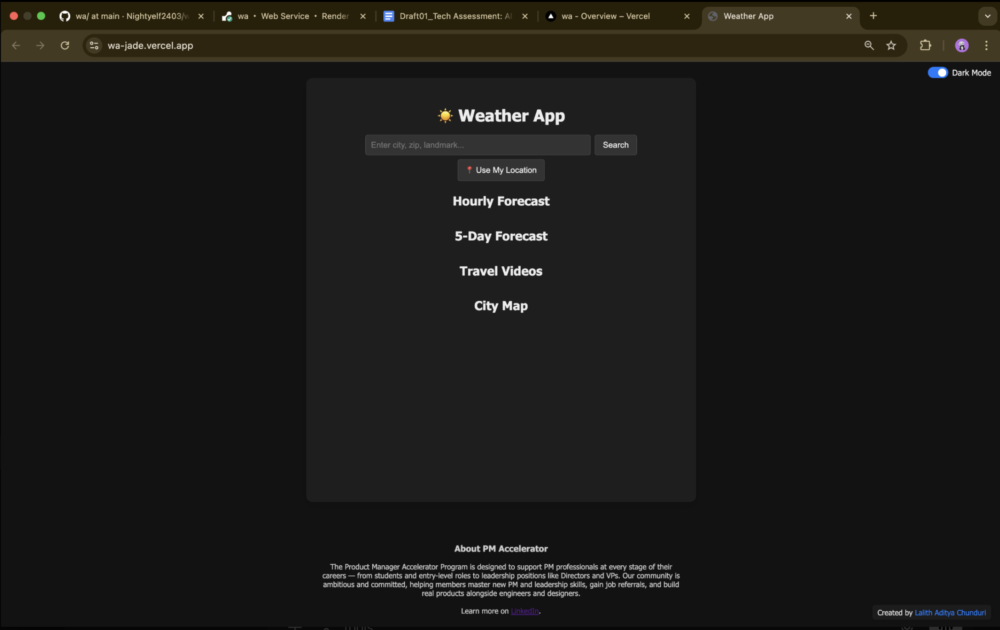
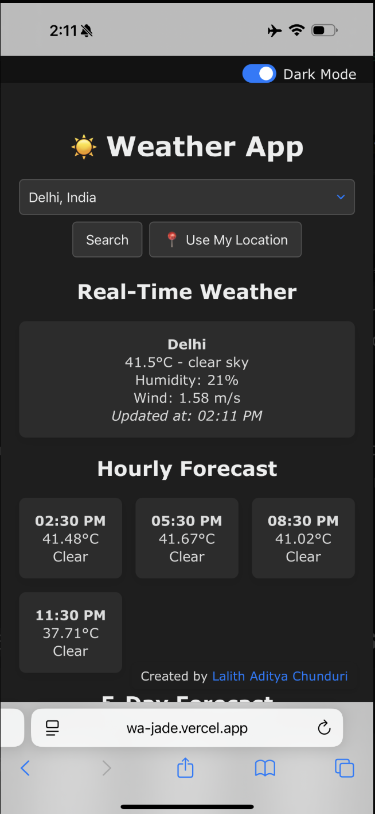

# 🌦️ Full-Stack Weather App  
*Created by Lalith Aditya Chunduri*  
*Deployed at: [wa-jade.vercel.app](https://wa-jade.vercel.app)*

---

## 🧩 Overview

This project is a full-stack weather application built to demonstrate strong technical proficiency in modern web development, API integration, error handling, and data management. It aligns with the PM Accelerator assessment requirements and showcases real-world developer skills through implementation of location-aware weather reporting, multimedia integration, and backend-driven data persistence and export.

---

weather-app/
│
├── backend/
│   ├── app.js                  # Main Express server setup – initializes routes and middleware
│   ├── .env                    # Environment file (API keys, DB URI, secrets)
│   ├── package.json            # Node.js dependencies and scripts
│   ├── package-lock.json       # Dependency lock file
│   │
│   ├── db/
│   │   └── sequelize.js        # Sequelize ORM configuration and DB connection
│   │
│   ├── models/
│   │   └── WeatherRecord.js    # Sequelize model defining structure of weather records
│   │
│   ├── routes/
│       ├── weather.js          # CRUD operations and real-time weather API integration
│       ├── forecast.js         # Handles 5-day and hourly forecast data fetch
│       ├── youtube.js          # Fetches YouTube travel videos for a given city
│       └── export.js           # Handles data export (JSON, CSV, PDF, Markdown)
│
├── frontend/
│   ├── index.html              # UI layout with inputs, toggle, containers for forecast/map
│   ├── style.css               # App styling including responsive layout and dark mode
│   └── script.js               # JS logic: user input, API calls, dark mode toggle, DOM updates
│
├── README.md                   # Project overview, setup instructions, and documentation
└── requirements.txt            # (Optional) Lists libraries/tools used, typically for backend


## 🌟 Key Features

### ✅ User-Focused Weather Tools
- Search weather by:
  - 📍 GPS coordinates
  - 🏙️ City / Zip code
  - 🗺️ Landmarks (via smart autocomplete)
- Real-time weather including:
  - Temperature, Condition, Humidity, Wind Speed
  - Displayed with a local `Updated at` timestamp
- 5-day forecast in a clean grid format
- Hourly forecast highlights upcoming temperature trends
- Mobile-responsive layout with dark/light mode toggle

### ✅ Technical Standouts
- Autocomplete suggestions using GeoDB Cities API
- Integrated YouTube travel videos based on searched city
- Embedded Google Map for geographical context
- Fully implemented CRUD operations on MongoDB
- Export data as:
  - 🧾 JSON
  - 📊 CSV
  - 📄 PDF
  - 📝 Markdown

### ✅ Graceful User Experience
- Clear error handling for invalid cities, location failures, or API errors
- Friendly UI across all screen sizes (desktop, tablet, mobile)
- Interactive design enhanced with real icons, transitions, and dark mode

---

## 💻 Technologies Used

### Frontend (Vercel Deployed)
- HTML5, CSS3 (Flexbox + Grid, Responsive Design)
- Vanilla JavaScript (ES6+)
- OpenWeatherMap API
- GeoDB Cities API (RapidAPI)
- YouTube Data API v3
- Google Maps Embed API

### Backend (Render Deployed)
- Node.js + Express.js
- MongoDB Atlas (NoSQL cloud database)
- Axios for API requests
- dotenv for environment variable management
- PDFKit, json2csv, csv-writer, markdown-pdf for data export
- CORS, body-parser for middleware and compatibility

---

## 🗃️ API Routes (Backend)

### 🔍 Weather Endpoints
| Method | Endpoint                  | Description                             |
|--------|---------------------------|-----------------------------------------|
| GET    | `/api/weather/search`     | Get current weather for a city          |
| GET    | `/api/forecast?city=...`  | Fetch hourly + 5-day forecast           |
| POST   | `/api/weather/create`     | Save weather data for location/date     |
| GET    | `/api/weather/read`       | Retrieve stored weather data            |
| PUT    | `/api/weather/update/:id` | Modify stored data                      |
| DELETE | `/api/weather/delete/:id` | Remove a weather record                 |

### 🧾 Export Routes
| Format    | Route                 |
|-----------|-----------------------|
| JSON      | `/api/export/json`    |
| CSV       | `/api/export/csv`     |
| PDF       | `/api/export/pdf`     |
| Markdown  | `/api/export/md`      |

### 🌐 Additional APIs
- `/api/youtube?city=...` → Fetches travel videos
- Google Map embedded via iframe

---

## 🧪 Sample Screenshots





> These screenshots reflect real API data with visual transitions, dark theme support, and dynamic rendering of content based on input.

---

## ⚙️ Setup & Deployment

### Local Setup

```bash
# Clone project
git clone https://github.com/Nightyelf2403/weather-app.git
cd weather-app

# Backend setup
cd backend
npm install
touch .env  # add your Mongo URI and API keys here
npm start

# Frontend setup
cd ../frontend
npm install
npm run dev
````

### Environment Variables (`.env`)

```env
PORT=5000
MONGO_URI=your_mongo_db_atlas_url
OPENWEATHER_API_KEY=your_openweather_key
YOUTUBE_API_KEY=your_youtube_data_api_key
GOOGLE_MAPS_API_KEY=your_google_maps_key
```

### Deployment

* **Frontend:** Vercel — [https://wa-jade.vercel.app](https://wa-jade.vercel.app)
* **Backend:** Render — https://wa-c1rh.onrender.com 

---

## 🏢 About PM Accelerator

The **Product Manager Accelerator Program** supports professionals across every stage of their PM careers — from students and entry-level talent to directors and VPs. Through real-world product building, mentorship, and mock interviews, the program equips candidates with modern PM and leadership skills.

🔗 Learn more on [LinkedIn → PM Accelerator](https://www.linkedin.com/school/pmaccelerator/about/)

---

## 🙋 Author & Credits

**Lalith Aditya Chunduri**
🖥️ [GitHub Profile](https://github.com/Nightyelf2403)
💡 Built as a full-stack project for PM Accelerator Tech Assessment (2025)

> This is a student-driven personal project. No license is applied — not for production use.
