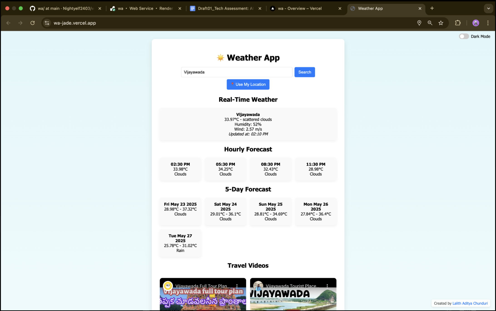

# 🌦️ Full-Stack Weather App  

**Created by:** Lalith Aditya Chunduri  
**Deployed at:** [wa-jade.vercel.app](https://wa-jade.vercel.app)  
🎥 **Walkthrough Video:** [Watch here](https://go.screenpal.com/watch/cThZfGn6Olw)

---

## 🧩 Overview

This project is a full-stack weather application built to demonstrate strong technical proficiency in modern web development, API integration, error handling, and data management. It aligns with the PM Accelerator assessment requirements and showcases real-world developer skills through implementation of location-aware weather reporting, multimedia integration, and backend-driven data persistence and export.

---

### 🔍 File Role Summary

#### 🔹 Frontend (HTML/CSS/JavaScript)

- `index.html` – Builds the web interface with city input, forecast cards, map, and videos.
- `style.css` – Provides the responsive design, grid layout, and dark mode styling.
- `script.js` – Handles:
  - City search and GeoDB autocomplete
  - Current weather and forecast API calls
  - Map embedding and YouTube video rendering
  - Theme switching and DOM manipulation

#### 🔹 Backend (Node.js, Express, MongoDB)

- `app.js` – Main entry point that initializes Express and mounts route files.
- `db.js` – Connects to MongoDB Atlas using Mongoose.
- `WeatherRecord.js` – Defines how weather data is stored in the database (city, range, temperature, etc.).
- `weather.js` – Handles:
  - Real-time weather search (`/search`)
  - Weather record creation, reading, updating, and deletion
- `forecast.js` – Calls OpenWeatherMap to get 5-day and hourly forecasts.
- `youtube.js` – Returns YouTube travel videos based on searched city.
- `export.js` – Exports data from the DB in various formats (JSON, CSV, PDF, MD).

#### 🔹 Other Files

- `.env` – Stores private API keys and database credentials (not pushed to repo).
- `package.json` – Lists backend dependencies (`express`, `axios`, `mongoose`, etc.).

---

## 🌟 Key Features

### ✅ User-Focused Weather Tools
- Search weather by:
  - 📍 GPS coordinates
  - 🏙️ City / Zip code
  - 🗺️ Landmarks (via smart autocomplete)
- Real-time weather details including:
  - Temperature, Condition, Humidity, Wind Speed
  - Displayed with a local `Updated at` timestamp
- 5-day forecast in a clean grid format
- Hourly forecast highlights upcoming temperature trends
- Mobile-responsive layout with dark/light mode toggle

### ✅ Technical Standouts
- Autocomplete suggestions using GeoDB Cities API
- Integrated YouTube travel videos based on searched city
- Embedded Google Map for geographical context
- Fully implemented CRUD operations on MongoDB Atlas
- Export data as:
  - 🧾 JSON
  - 📊 CSV
  - 📄 PDF
  - 📝 Markdown

### ✅ Graceful User Experience
- Clear error handling for invalid cities, location failures, or API errors
- Responsive and user-friendly UI across all screen sizes (desktop, tablet, mobile)
- Interactive design enhanced with real icons, transitions, and dark mode

---

## 💻 Technologies Used

### Frontend (Vercel Deployed)
- HTML5, CSS3 (Flexbox + Grid, Responsive Design)
- Vanilla JavaScript (ES6+)
- OpenWeatherMap API
- GeoDB Cities API (RapidAPI)
- YouTube Data API v3
- Google Maps Embed API

### Backend (Render Deployed)
- Node.js + Express.js
- MongoDB Atlas (NoSQL cloud database)
- Mongoose for MongoDB schema and model management
- Axios for API requests
- dotenv for environment variable management
- PDFKit, json2csv, csv-writer, markdown-pdf for data export
- CORS, body-parser for middleware and compatibility

---

## 🗃️ API Routes (Backend)

### 🔍 Weather Endpoints
| Method | Endpoint                  | Description                             |
|--------|---------------------------|-----------------------------------------|
| GET    | `/api/weather/search`     | Get current weather for a city          |
| GET    | `/api/forecast?city=...`  | Fetch hourly + 5-day forecast           |
| POST   | `/api/weather/create`     | Save weather data for location/date     |
| GET    | `/api/weather/read`       | Retrieve stored weather data            |
| PUT    | `/api/weather/update/:id` | Modify stored data                      |
| DELETE | `/api/weather/delete/:id` | Remove a weather record                 |

### 🧾 Export Routes
| Format    | Route                 | View/Download                           |
|-----------|-----------------------|------------------------------------------|
| JSON      | `/api/export/json`    | View in browser                          |
| CSV       | `/api/export/csv`     | View/download CSV                        |
| PDF       | `/api/export/pdf`     | Download PDF                             |
| Markdown  | `/api/export/md`      | Download .md file                        |

### 🌐 Additional APIs
- `/api/youtube?city=...` → Fetches YouTube travel videos
- Google Map is embedded using iframe on the frontend

---

## 🧪 Sample Screenshots

  
  


> These screenshots reflect real API data with visual transitions, dark theme support, and dynamic rendering of content based on input.

---

## ⚙️ Setup & Deployment

### 🔧 Local Setup

```bash
# Clone project
git clone https://github.com/Nightyelf2403/weather-app.git
cd weather-app

# Backend setup
cd backend
npm install
# Create .env file (on Unix)
touch .env
# On Windows, create a .env file manually
npm start

# Frontend setup
cd ../frontend
npm install
npm run dev
